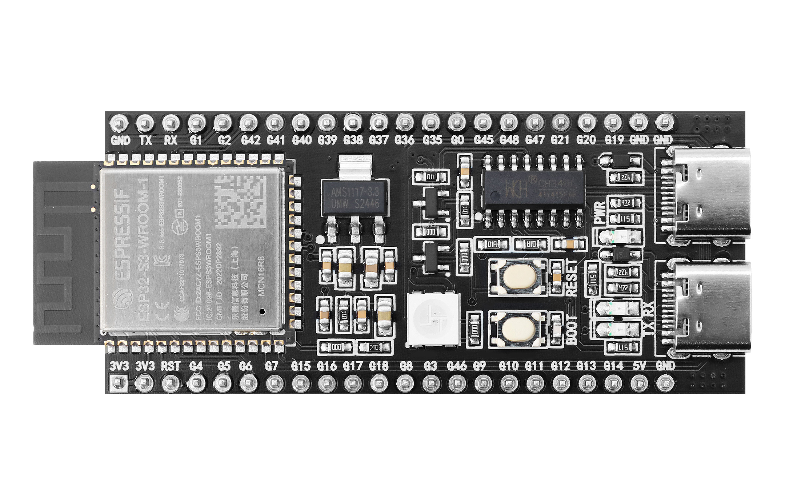
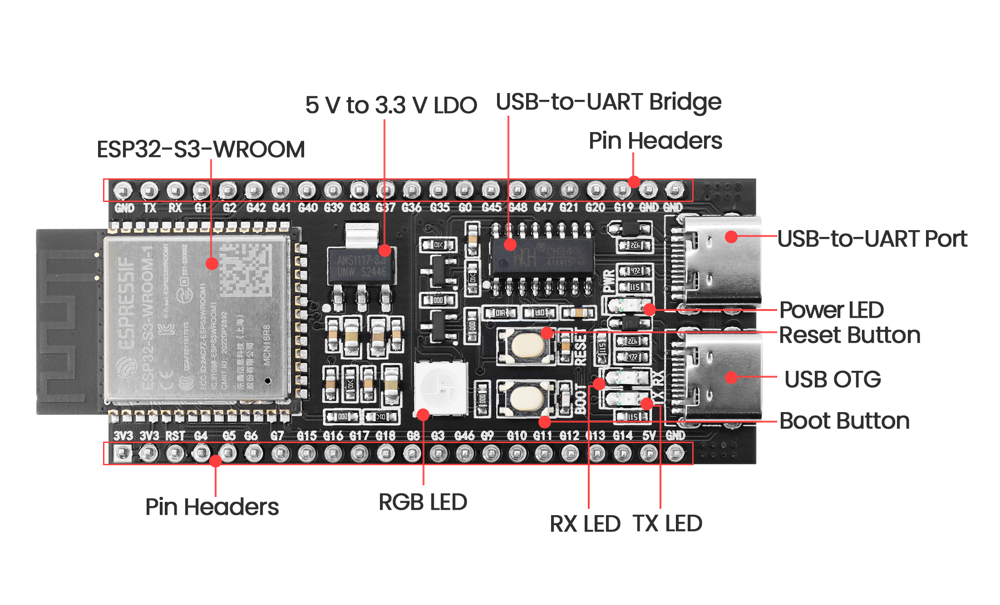

# ESP32-S3-DevKitC-1 开发板详细介绍

## 概述

**ESP32-S3-DevKitC-1** 是一款功能强大的开发板，基于 Espressif 的 **ESP32-S3** 系列芯片。该开发板通过集成 Wi-Fi 和 Bluetooth® LE 模块，为物联网 (IoT) 和人工智能 (AIoT) 应用提供了极大的灵活性与支持。其丰富的 GPIO 接口和强大的处理能力，使开发者能够轻松连接各种外部硬件，开发复杂的嵌入式系统。

## 主要特性

- **处理器**：
  - 基于 **Xtensa® LX7** 双核处理器，主频最高可达 **240 MHz**。
  - 支持机器学习推理加速，适用于 AI 应用（如语音识别和图像处理）。
  
- **无线连接**：
  - 支持 **802.11 b/g/n Wi-Fi**（仅限于 2.4 GHz）。
  - 支持蓝牙 5.0 和蓝牙低功耗 (BLE)。

- **内存**：
  - 512 KB SRAM；支持外部 **SPI Flash** 和 **PSRAM** 扩展。

- **GPIO 接口**：
  - 提供多达 **38 个 GPIO 引脚**，包括：
    - 支持 **ADC**（12 位分辨率）、**DAC**、**PWM**、**I2C**、**SPI** 和 **UART** 等多种通信协议。

- **安全特性**：
  - 硬件加密支持（AES、SHA、RSA 等）。
  - 支持 **Secure Boot** 和 **Flash Encryption**，提供安全防护。

- **外设**：
  - 集成多个硬件加速器，支持信号加速处理，可提高性能。
  - 内置 **LED 指示灯** 和按钮（如 Boot 和 Reset 按钮），方便开发和调试。

## 硬件描述

- **电源管理**：
  - 输入电压范围：**3.0V 到 5V**。
  - 在待机模式下功耗低至 **10 μA**，在 Wi-Fi 运行时的功耗也经过了优化，适合便携式电池供电设备。

- **物理尺寸**：
  - 尺寸约为 **70mm x 28mm**，便于嵌入各种项目中。

- **连接接口**：
  - 通过 **type C USB** 接口供电，并进行数据传输（编程和调试）。
  - 具有多种标准接口，方便与外设连接。

## 开发生态

ESP32-S3-DevKitC-1 兼容多种开发平台，支持开发者使用以下环境进行开发：

- **Arduino IDE**：提供简洁易用的界面，适合初学者进行快速开发。
- **ESP-IDF**（Espressif IoT Development Framework）：适合高级开发者进行复杂项目的定制开发。
- **PlatformIO**：支持多种集成开发环境，助力现代化开发工作流。

## 应用领域

ESP32-S3-DevKitC-1 的应用场景非常广泛，包括但不限于：

- **智能家居**：产品如智能开关、照明控制、环境监测器等。
- **健康监测**：可穿戴设备、健康追踪器等，进行实时数据采集和分析。
- **工业自动化**：用于数据采集、远程监控和设备控制，提高生产效率。
- **边缘计算**：在 IoT 网络中处理和分析数据，减少延迟和带宽消耗。

