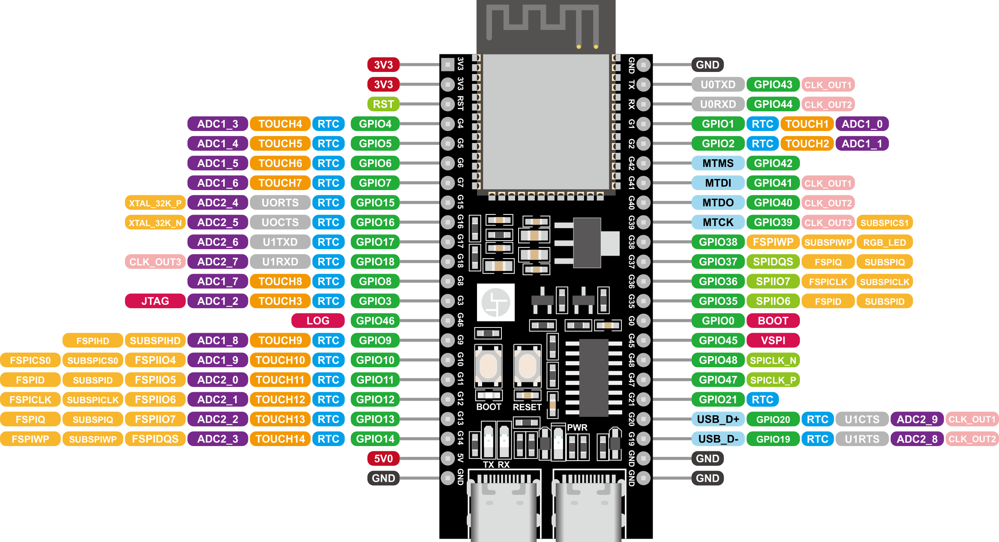
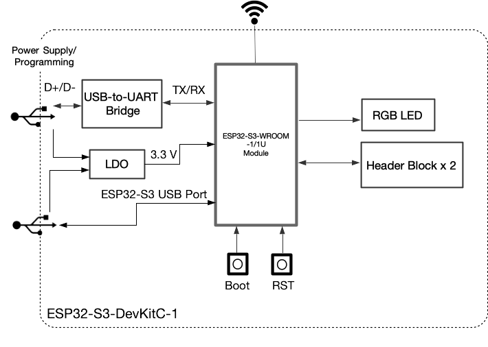

# ESP32-S3-DevKitC-1 引脚功能表

| 引脚号 | 引脚名称   | 类型  | 功能描述                                     |
|--------|------------|-------|----------------------------------------------|
| 1      | 3V3        | P     | 3.3 V 电源                                   |
| 2      | 3V3        | P     | 3.3 V 电源                                   |
| 3      | RST        | I     | 重置引脚                                     |
| 4      | GPIO4      | I/O/T | RTC GPIO 4, GPIO 4, TOUCH 4, ADC1_CH3       |
| 5      | GPIO5      | I/O/T | RTC GPIO 5, GPIO 5, TOUCH 5, ADC1_CH4       |
| 6      | GPIO6      | I/O/T | RTC GPIO 6, GPIO 6, TOUCH 6, ADC1_CH5       |
| 7      | GPIO7      | I/O/T | RTC GPIO 7, GPIO 7, TOUCH 7, ADC1_CH6       |
| 8      | GPIO15     | I/O/T | RTC GPIO 15, GPIO 15, U0RTS, ADC2_CH4       |
| 9      | GPIO16     | I/O/T | RTC GPIO 16, GPIO 16, U0CTS, ADC2_CH5       |
| 10     | GPIO17     | I/O/T | RTC GPIO 17, GPIO 17, U1TXD, ADC2_CH6       |
| 11     | GPIO18     | I/O/T | RTC GPIO 18, GPIO 18, U1RXD, ADC2_CH7       |
| 12     | GPIO8      | I/O/T | RTC GPIO 8, GPIO 8, TOUCH 8, ADC1_CH7       |
| 13     | GPIO3      | I/O/T | RTC GPIO 3, GPIO 3, TOUCH 3, ADC1_CH2       |
| 14     | GPIO46     | I/O/T | GPIO 46                                      |
| 15     | GPIO9      | I/O/T | RTC GPIO 9, GPIO 9, TOUCH 9, ADC1_CH8       |
| 16     | GPIO10     | I/O/T | RTC GPIO 10, GPIO 10, TOUCH 10, ADC1_CH9    |
| 17     | GPIO11     | I/O/T | RTC GPIO 11, GPIO 11, ADC2_CH0               |
| 18     | GPIO12     | I/O/T | RTC GPIO 12, GPIO 12, ADC2_CH1               |
| 19     | GPIO13     | I/O/T | RTC GPIO 13, GPIO 13, ADC2_CH2               |
| 20     | GPIO14     | I/O/T | RTC GPIO 14, GPIO 14, ADC2_CH3               |
| 21     | 5V         | P     | 5 V 电源                                     |
| 22     | GND        | G     | 地线                                         |

## J3 排针引脚定义

| 引脚号 | 引脚名称   | 类型  | 功能描述                                     |
|--------|------------|-------|----------------------------------------------|
| 1      | GND        | G     | 地线                                         |
| 2      | TX         | I/O/T | U0TXD, GPIO 43, CLK_OUT1                    |
| 3      | RX         | I/O/T | U0RXD, GPIO 44, CLK_OUT2                    |
| 4      | GPIO1      | I/O/T | RTC GPIO 1, GPIO 1, TOUCH 1, ADC1_CH0      |
| 5      | GPIO2      | I/O/T | RTC GPIO 2, GPIO 2, TOUCH 2, ADC1_CH1      |
| 6      | GPIO42     | I/O/T | MTMS, GPIO 42                                |
| 7      | GPIO41     | I/O/T | MTDI, GPIO 41                                |
| 8      | GPIO40     | I/O/T | MTDO, GPIO 40                                |
| 9      | GPIO39     | I/O/T | MTCK, GPIO 39, CLK_OUT3                     |
| 10     | GPIO38     | I/O/T | FSPIWP, GPIO 38, RGB LED                    |
| 11     | GPIO37     | I/O/T | SPIDQS, GPIO 37, FSPIQ                      |
| 12     | GPIO36     | I/O/T | SPIIO7, GPIO 36, FSPICLK                    |
| 13     | GPIO35     | I/O/T | SPIIO6, GPIO 35, FSPID                      |
| 14     | GPIO0      | I/O/T | RTC GPIO 0, GPIO 0                           |
| 15     | GPIO45     | I/O/T | GPIO 45                                      |
| 16     | GPIO48     | I/O/T | GPIO 48, SPICLK_N                            |
| 17     | GPIO47     | I/O/T | GPIO 47, SPICLK_P                            |
| 18     | GPIO21     | I/O/T | RTC GPIO 21, GPIO 21                        |
| 19     | GPIO20     | I/O/T | RTC GPIO 20, GPIO 20                        |
| 20     | GPIO19     | I/O/T | RTC GPIO 19, GPIO 19                        |
| 21     | GND        | G     | 地线                                         |
| 22     | GND        | G     | 地线                                         |

## 引脚类型说明

- **P**: 电源引脚（Power）。
- **G**: 地线引脚（Ground）。
- **I**: 输入引脚（Input）。
- **O**: 输出引脚（Output）。
- **T**: 三态引脚（Tri-state）。

## 功能框图

